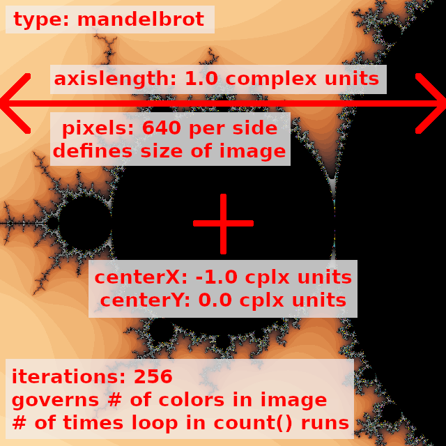

# CS 1440 Assignment 5.1: Design Patterns - Instructions

**Important!  This is the last assignment that is eligible for the Grading Gift**

[TOC]


## Description

Take this fractal generating program to the next level by applying good
principles of *Object-Oriented Design*.  Your goal is to create a program that
can stand the test of time by being easy to test, modify and extend.

Additionally, because your program accepts input files in a standard format,
you will be able to share your fractal creations with your classmates.

After successfully refactoring your client's program into a form which is
easier to work on and think about, you are ready to take this program to the
next level.  In this sprint you will apply the [Factory Method](https://sourcemaking.com/design_patterns/factory_method) design pattern
to your code.  Through judicious use of this design pattern your program will
evolve from being merely maintainable to easily extensible.  A little bit of
planning and energy spent now will set the stage for many years of smooth
maintenance in the future.


## Previous Semester Assignment Statistics

Statistic                        | Value
--------------------------------:|:---------------
Average Hours Spent              | 11.91
Average Score % (Grade)          | 76.6% (C)
% students thought this was Easy | 6.8%
... Medium                       | 42.7%
... Hard                         | 31.6%
... Too Hard/Did not complete    | 17.9%


## Following the Software Development Plan

Your grade on this assignment depends upon how well you follow the SDP.  You demonstrate this by following instructions, through your documentation, and by *tagging* commits.

-   This is the second sprint of this assignment.
    -   Do not remove or change tags submitted in the first sprint.
-   Incorrectly spelled/capitalized tags are ignored.
-   Read the [assignment penalties](./Rubric.md#penalties) to know what kinds of problems we are on the lookout for.
-   **If you tag the wrong commit**, refer to `Using_Git/Intermediate_Git.md` in the lecture notes for instructions.

0.  Tag `5.1-analyzed` on the commit at the end of **Phase 1: System Analysis**.  Your work up to this point includes:
    *   Carefully study the [Requirements](#requirements) section below
    *   `Plan.md`
        *   Phases 0 and 1 are complete.
        *   Filler text is **erased** once your information is filled in.
    *   `Signature.md` is updated with your activity up to this point.
    *   *Grace Points: if the `5.1-analyzed` tag is pushed by midnight on the Sunday before the due date, you will receive up to 5 points back from other lost points on this assignment*
1.  Tag `5.1-designed` on the commit at the end of **Phase 2: Design**.  Your work up to this point includes:
    *   A new draft of the **User's Manual** describing the anticipated user interface (UI) of the final product
    *   A new draft of your UML Class Diagram describing the anticipated organization of the final product
        *   Save it as a PDF named `doc/UML-5.1.pdf`
        *   Do not include Unit Test files
            *   If the word "test" appears in the file's name, leave it off
    *   First draft of unit tests are written 
        *   Practice Test-Driven Development: at this point in the project these tests will not pass because they code they test hasn't yet been written
        *   These tests are a design tool that help you plan what these classes will do
        *   You may need to update these tests as you find and fix problems with your program (or the tests themselves!)
    *   `Plan-5.1.md`
        *   Each sprint gets its own SDP document.
        *   Phase 2 includes **clear and easy to read** descriptions and pseudocode for each function/method that you will write in the program (you are not required to write pseudocode for code provided by the instructor).
        *   Phase 4 includes descriptions of the Unit Tests that were written
        *   Filler text is **erased** once your information is filled in
        *   Do not paste Python code into the Plan
        *   Try not to write executable pseudocode; *if we can paste your pseudocode into the REPL and run it, you're doing it wrong*
    *   `Signature.md` is updated
    *   *Grace Points: if this tag is pushed by end of day the Sunday before the due date, you will receive up to 5 points back from other lost points on this assignment*
2.  Tag `5.1-implemented` on the commit at the end of **Phase 3: Implementation**.  Your work up to this point includes:
    *   Runnable source code under `src/`
    *   `Plan.md`
        *   Phase 3 **does NOT include copy and pasted code**
        *   Changes from your original plan are noted here, with an explanation of why you changed it
        *   If you did not deviate from your plan, erase the filler text and leave this part blank
    *   `Signature.md` is updated
3.  Tag `5.1-tested` on the commit at the end of **Phase 4: Testing and Debugging**.
    *   *This tag may be on the same commit as `5.1-implemented`*.  Your work up to this point includes:
    *   `Plan-5.1.md`
        *   Phase 4 lists the commands you ran to test your program, with brief descriptions of what a user should expect to see when they run the same commands.
            * Example:
                ```
                Command Ran: <what command did you run in the command line>
                Bug Found: <if a bug was found, what was it? Otherwise note here that it worked as expected>
                Bug Fixed: <if there was a bug, then note here how you fixed it>
                ```
        *   This proves that you tested your program, and lets us replicate your results.
        *   It also tells us what bugs were found and how you fixed them.
        *   Filler text is **erased** once your information is filled in.
    *   `Signature.md` is updated.
4.  Tag `5.1-deployed` on the commit that you want us to grade for this sprint.
    *   This tag lets you continue to work on the next sprint without the grader marking your submission late.
    *   *This tag may be on the same commit as `5.1-tested` and `5.1-implemented`*.  Your work up to this point includes:
    *   `Plan-5.1.md`
        *   Phase 5 may be left blank, there isn't much for you to say.
        *   Phase 6 is filled out, organized and easy-to-read.
        *   Filler text is **erased** once your information is filled in.
    *   `Signature.md` is filled out and **there are no more TODOs/filler entries**.
    *   `doc/UML-5.1.pdf` matches your final code submission.
    *   **OPTIONAL** If you have special instructions for the grader, *erase the contents of `README.md` in the root directory* and replace it with your instructions.
        *   Do not request your **Grading Gift** in `README.md` or in Git commit messages.
5.  The tags `5.1-analyzed` and `5.1-designed` must be on their own commits; they cannot be together.
    *   The tags `5.1-implemented`, `5.1-tested`, and `5.1-deployed` *may* be on the same commit.
    *   Make sure that each tag has the appropriate file(s) completed/filled out.


## Requirements

0.  Define a `Fractal` abstract class and at least *four* concrete subclasses
    -   The `Fractal` abstract class exists solely to provide a common structure to the concrete classes that inherit from it.
        -   Your program will not create plain `Fractal` objects.
        -   It will instead use classes derived from `Fractal` through inheritance.
    -   `Fractal` provides a placeholder `count()` method which raises an exception when called.
        -   It consists solely of this statement: `raise NotImplementedError("Concrete subclass of Fractal must implement count() method")`
    -   You are allowed (but not required) to define data members in the `Fractal` class that may be used by derived classes.
        -   You can call `Fractal`'s `__init__` from a derived classes' initializer like this:
            ```python
            # call parent class initializer with 0 parameters:
            super().__init__()
            
            # call parent class initializer with 3 parameters:
            super().__init__(a, b, c)
            ```
    -   You are allowed (but not required) to define other methods besides `count()`.
        -   These methods are available to all derived classes of `Fractal`.
        -   These methods do not need to raise `NotImplementedError`.
    -   The `Phoenix` and `Mandelbrot` classes inherit their structure from `Fractal`, and are obligated to provide their own implementations of `count()` such that they do not raise `NotImplementedError` when used.
    -   `count()` takes one complex number as input and returns an integer that is the number of iterations tried before the absolute value of the fractal formula grew larger than `2.0`; otherwise the maximum number of iterations is returned.
        -   This operation is the defining characteristic of an object derived from the `Fractal` class.
    -   Other data needed by `count()` are supplied through the `self` reference.
    -   Define at least **two** new concrete subclasses of `Fractal` following the pattern set forth by `Phoenix` and `Mandelbrot`, but using different formulae.
        -   `Phoenix` and `Mandelbrot` are counted towards the *four* required subclasses
        -   Only *one* subclass can be created by raising an existing formula to a higher power
        -   You may also devise your own fractal formula.  Get creative!
        -   See the section [More Iteration Formulae](#more-iteration-formulae) below
        -   If your new fractal class requires new configuration parameters, augment your `FractalFactory` class to handle them (see below)
    -   The concrete subclasses of `Fractal` are used _interchangeably_ in your program.
        -   This is an example of *polymorphism*: objects of different classes are used in the same way.
        -   The code which uses a `Fractal`-derived object does not inspect the object to determine what kind of fractal it is; it just works because it defines the `count()` method.
            -   Directly inspecting the type of an object (i.e. checking `isinstance(frac, Phoenix)`) before use defeats the purpose of polymorphism.  A submission that does this will lose points.
    -   `Fractal` objects have no relation whatsoever to `Palettes`, nor any knowledge about `Colors`.
        -   Information that relates to a `Palette` (such as its length) can be known by a `Fractal` object if needed, **but your fractal should not get this information from a `Palette` object or the `Palette` module directly**
1.  `FractalFactory` class or module
    -   Follow the [Factory Method Pattern](https://sourcemaking.com/design_patterns/factory_method) in your program when you need to instantiate objects embodying fractal algorithms.  `FractalFactory` returns a concrete fractal object based upon a configuration file given to it from the main program.  See below for details about the format of the fractal configuration file.
    -   The file defining `FractalFactory` is the only place in your entire program where your concrete `Fractal`-derived classes need to be imported.
    -   The `FractalFactory` itself doesn't have to be an object that you instantiate; it can be a function within a module.
        -   For example, this is how a `FractalFactory` object would be used:
        -   ```python
            from FractalFactory import FractalFactory
            
            fractalInfo = ... # get a data structure about the fractal
            factory = FractalFactory()
            fractal = factory.makeFractal(fractalInfo)
            ```
        - Instead, `FractalFactory` might be a module containing the function `makeFractal()`:
        -   ```python
            import FractalFactory

            fractalInfo = ... # get a data structure about the fractal
            fractal = FractalFactory.makeFractal(fractalInfo)
            ```
    -   When no fractal configuration file is specified by the user on the command line, `FractalFactory` produces a "default" fractal configuration object (or dictionary).
        -   This default object is hard-coded into your program
        -   **Important:** hard-coding the *path* to a fractal configuration file in `data/` is **not acceptable**
        -   Do not assume that directory will be available when your program is run!
    -   `FractalFactory` must perform some error checking upon the contents of the fractal configuration file it uses to create a `Fractal` object.
        *   When a missing or inaccessible fractal is called for, simply let the `open()` function fail.
        *   When an unrecognized fractal type is encountered, raise [`NotImplementedError`](https://docs.python.org/3/library/exceptions.html#NotImplementedError)
        *   When a fractal configuration file contains other errors, raise [`RuntimeError`](https://docs.python.org/3/library/exceptions.html#RuntimeError).  Possible errors are described in the section "Fractal Configuration File Format" below.
2. `FractalParser` class or module
    *   Reads the `.frac` file named on the command line and converts its contents into a form usable by your program
        *   Previously, fractal information was written directly into dictionaries in the program's source code
        *   Now this data is stored externally so that new fractals can be added without needing to re-write the program's source code
        *   *Design Hint: convert this text file's contents in a dictionary instead of returning a `Fractal` object; making a `Fractal` is the responsibility of `FractalFactory`*
    *   Verifies that the `.frac` file named on the command line is correctly formatted
        *   Raise a `RuntimeError` when a problem is detected
        *   Read [Fractal configuration file format](#fractal-configuration-file-format) for more details about what these files should contain
    *   The information provided by this module becomes the input to the `FractalFactory` and `PaletteFactory`
3.  Create a `Palette` class and *two* concrete subclasses
    -   The `Palette` class exists solely to provide a common structure to the concrete classes that inherit from it.  Your program will not create plain `Palette` objects.  It will instead use classes derived from `Palette` through inheritance.
    -   `Palette` provides a placeholder `getColor()` method which raises an exception when called.  It consists solely of this statement: `raise NotImplementedError("Concrete subclass of Palette must implement getColor() method")`
    -   You are allowed (but not required) to define data members in the `Palette` class that are to be used by derived classes.
        -   You can call `Fractal`'s `__init__` from a derived classes' initializer like this:
            ```python
            # call parent class initializer with 0 parameters:
            super().__init__()
            
            # call parent class initializer with 3 parameters:
            super().__init__(a, b, c)
            ```
    -   You are allowed (but not required) to write other methods besides `getColor()`.
        -   These methods do not need to raise `NotImplementedError`.
        -   These methods would then be available in all derived classes of `Palette`.
    -   Concrete subclasses of `Palette` inherit their structure from the abstract class `Palette`, and are obligated to provide their own implementations of `getColor()` such that they will not raise `NotImplementedError` when used.
    -   `getColor(n)` takes an integer as input and returns a string which represents a color in this format: `"#RRGGBB"`.
        -   This operation is the defining characteristic of a  `Palette`  object.
    -   Other data used by `getColor(n)` are supplied through `self`.
    -   Define at least **two** concrete subclasses of `Palette` classes that provide alternative color palettes.
        -   Generalize color palette creation so that a user-defined number of iterations may be specified instead of using a hard-coded array of colors.
            -   Take some time to make your color palette *look good* for any number of iterations between 64 and 512.  Transition between opposing colors to increase the contrast and detail in the final image.
            -   Some programmers use the modulus `%` operator to create color palettes  of "repeating stripes" to gracefully handle large iteration counts. You *may* do this for some of your color palettes, but **at least one** palette must by *dynamically generated* using the `colour` module and the `Color.range_to` method.
    -   The concrete subclasses of  `Palette`  are used _interchangeably_ in your program.  This is an example of polymorphism in action: objects of different classes which are used in the same way.  The code which uses a `Palette`-derived object does not inspect the object to determine what kind of palette it is; it just works because it defines the `getColor()` method.
            -   Directly inspecting the type of an object (i.e. checking `isinstance(pal, ColorCube)`) before use defeats the purpose of polymorphism.  A submission that does this will lose points.
    -   `Palette` objects have no relation to nor knowledge of `Fractal` and its derived classes, nor should it expect to be used directly by a `Fractal` object.
4.  `PaletteFactory` class or module
    -   Follow the [Factory Method Pattern](https://sourcemaking.com/design_patterns/factory_method) in your program when you need to instantiate objects embodying palettes.  `PaletteFactory` returns a concrete palette object specified by the user on the command line.
    -   The file defining `PaletteFactory` is the only place in your entire program where your concrete `Palette`-derived classes need to be imported.
    -   The `PaletteFactory` itself doesn't have to be an object that you instantiate; it can be a function within a module.
        -   ```python
            from PaletteFactory import PaletteFactory
            
            factory = PaletteFactory()
            palette = factory.makePalette(paletteName)
            ```
        -   Instead, `PaletteFactory` might be a module containing the function `makePalette()`:
        -   ```python
            import PaletteFactory
            
            palette = PaletteFactory.makePalette(paletteName)
            ```
    -   When no palette is specified on the command line, `PaletteFactory` chooses and returns a default palette.  As the author of this factory, you get to decide which palette is the default.  This choice is _not_ coded into the `main.py` driver program; it is wholly under the purview of the `PaletteFactory`.
        -   This does not mean that your factory returns a hard-coded array of colors
        -   Pick from among your available color palette classes and return one of them as an object.
    -   When a non-existent palette is asked for, `NotImplementedError` is raised
        ```python
        raise NotImplementedError("Invalid palette requested")
        ```
    -   `PaletteFactory` needs some information about a fractal to properly construct a `Palette` to be used with it (e.g. the number of iterations).  Information returned by `FractalParser` *may* be given to `PaletteFactory`.  However, the actual `Palette` object *should not* contain or use the `fractalInfo` object directly.
        ```python
        import FractalParser
        import PaletteFactory

        fractalInfo = FractalParser.parseFracFile(sys.argv[1])
        palette = PaletteFactory.makePalette(paletteName, fractalInfo)
        ```
5.  `ImagePainter` class
    -   Continuing the work of the last sprint, convert this module into a class
        -   This class remains the *only* place in the program where `tkinter` is imported and used directly
    -   The `ImagePainter` constructor takes the products of the `FractalFactory`, `PaletteFactory`, and `FractalParser` as input
        -   Create the `ImagePainter` object in `main.py` **after** the factories have done their thing
        -   The `ImagePainter` does not use or know about the factories; it simply consumes their products
        -   Neither does the `ImagePainter` know about command-line arguments or `.frac` files
            -   It *may* see a data-structure which stores the result of parsing this `.frac` file
    -   The `ImagePainter` employs the **Strategy Design Pattern** when it calls a fractal object's `.count()` method
        -   `ImagePainter` does **not** use an `if`/`elif`/`else` decision tree that handles each type of fractal individually
        -   It relies on Duck-Typing to treat all `Fractal`s exactly the same
        -   `ImagePainter` *directly* takes advantage of polymorphism and the fact that each `Fractal` "quacks" the same way with the `Fractal.count()` method
6.  Documentation (UML, user manual, etc.) from the previous assignment is congruent with final the product.  List the names of possible palettes in the user manual as this program will not regard absent command line arguments as an error and will not print a usage message.
7.  Eight (8) meaningful, non-trivial unit tests that pass.


## Command line interface

The command line interface to your program must follow this format:

```
python src/main.py [FRACTAL_FILE [PALETTE_NAME]]
```

0.  `FRACTAL_FILE` is the **optional** name of a fractal configuration file found in the data directory of the original repository.
    -   It is an error if this file name is misspelled, or refers to a file which your program cannot open.
    -   It is also an error when this file does not follow the format described below.
1.  `PALETTE_NAME` is an **optional** name of a palette which your `PaletteFactory` can produce.

When zero arguments are given, your factories create and return default objects. For example:

```
$ python src/main.py
FractalFactory: Creating default fractal
PaletteFactory: Creating default color palette
```

**IMPORTANT: Because of this behavior, this program *cannot* print a usage message when no arguments are given.**  Instead, users will rely on the user's manual to learn how to run your program.


When only one argument is given, it is used as the name of a fractal configuration file.  A default color palette is chosen by the program:

```
$ python src/main.py data/julia.frac
PaletteFactory: Creating default color palette
```

When two arguments are given, the first is used as the name of a fractal configuration object and the second is the name of a color palette:

```
$ python src/main.py data/funnel-down.frac ColorCube
```

When an missing, or inaccessible fractal configuration file is given, the program exits with the error raised by `open()`:

```
$ python src/main.py data/NOT_EXIST ColorCube
Traceback (most recent call last):
  File "src/main.py", line 26, in <module>
    fractal = FractalParser.parseFracFile(fracFileName)
  File "/home/fadein/cs1440-falor-erik-assn5/src/FractalParser.py", line 30, in parseFracFile
    with open(cfgFile) as f:
FileNotFoundError: [Errno 2] No such file or directory: 'data/NOT_EXIST'
```

**IMPORTANT: Do not hard-code any assumptions about where these files are found in your program.**


When an invalid palette name is requested, exit by raising `NotImplementedError`:

```
$ python src/main.py data/funnel-down.frac NOT_EXIST
Traceback (most recent call last):
  File "src/main.py", line 27, in <module>
    palette = PaletteFactory.makePalette(fractal.iterations, gtype=palette)
  File "/home/fadein/cs1440-falor-erik-assn5/src/PaletteFactory.py", line 49, in makePalette
    raise NotImplementedError("Invalid palette requested")
NotImplementedError: Invalid palette requested
```


### Default Fractal Requirements

You have a lot of latitude to when it comes to choosing your default fractal
and palette.  We ask you to follow these requirements to keep your program's
run-time modest while still illustrating its capabilities.

The default fractal must:

0.  Be no larger than `640x640` and no smaller than `256x256` in size
1.  Have a maximum iteration count between `64` and `256`
    *   The default color palette must be dynamically generated for the maximum iteration value you choose
2.  The picture that is drawn must be of some "fascinating" fractal behavior
    *   What is considered "fascinating" is very subjective; we are looking for notable variation in your default fractal's image, and not a mostly-blank canvas
    *   The default fractal will be the first impression your program leaves on our client; make it a good one!
3.  The default fractal's configuration information is directly hard-coded into the source code, and is *not* read from an external `.frac` file by means of a hard-coded file path.
    *   Hard-coding a path makes your program crash when it is not run from a specific directory or if that file goes missing
    *   It's okay to hand-code a dictionary or something similar


## Fractal configuration file format

Fractal configuration files have a simple format: they are line-oriented text
files with one key/value pair per line.  Key/value pairs are separated by a
colon `:`.  This format is easily converted into dictionaries by your program.
Dictionaries are the best way to store this data.  You are allowed to use
another data structure to store information read from `.frac` file.

Study the files in the [../data/](../data/) directory, especially
[../data/invalid.frac](../data/invalid.frac). That is an example of what
**NOT** to do!

*   Lines starting with `#` are ignored
    *   They are used as comments
    *   You do not need to specially handle `#` in the middle or end of a line
*   All white space is disregarded
    *   Strip all white space from the input data
    *   Skip blank lines
*   Configuration items can appear in *any* order...
    *   ...since you will store them in a dictionary this does not matter
    *   If a configuration item is repeated, the *last one* overrides what came before
*   The names of configuration items are case-insensitive
    *   UPPERCASE, lowercase, or a MiXtUrE don't matter
    `axislength`  ==  `axisLength` ==  `AXISLENGTH`
    *   Convert all text to lower case as you read it into your program.
*   Item names are separated from their values with a colon `:`
    *   White space around the `:` is *optional*; don't count on it being there
*   The presence of unrecognized or misspelled item names is **NOT** an error
    *   Your program may add these to the dictionary OR ignore them
*   It is an error when items marked **required** below are not present in the configuration file
*   The data type of configuration items used by your program matters
    *   It is an error to supply a value of the wrong type
    *   It is an error to leave a value blank


### Valid items in fractal configuration files

*   `type` - *str* **required**
    *   Informs the program which fractal formula to apply.
    *   For example, this may be `Mandelbrot`, `Phoenix` or `BurningShipJulia`.
    *   You will define new fractal types that your program can support.
*   `centerX` - *float* **required**
    *   The center point of the image along the X axis.
    *   a.k.a. the "real" axis.
*   `centerY` - *float* **required**
    *   The center point of the image along the Y axis
    *   a.k.a. the "imaginary" axis.
*   `axisLength` - *float* **required**
    *   Defines the size of the square on the complex plane this image covers.
    *   Because the images are square, both axes are the same size.
    *   Making this value smaller results in a *zoomed-in* image.
    *   Making this value larger results in a *zoomed-out* image.
*   `pixels` - *int* **required**
    *   The width (and height) of the image in pixels.
    *   Increasing this parameter increases:
        *   the size of the image.
        *   the amount of detail visible in the image.
        *   the amount of time it takes to generate the image.
*   `iterations` - *int* **required**
    *   The number of iterations the central `for` loop runs before giving up on coloring a pixel.
    *   This is equal to the number of colors in the image.
    *   Increasing this parameter means increasing...
        *   ...the amount of time it takes to render the image
        *   ...the amount detail visible in the image, provided your color palette has enough distinct, contrasting colors
*   `creal` and `cimag` - *float* **optional**
    *   The real and imaginary components of the `C` constant which is used by fractals that are variations of the Julia formula.
    *   These items are **required** only for fractals using a variation of the Julia formula.
    *   Your program should raise an error if either of these are missing when `type == phoenix`, `type == julia` or `burningshipjulia`.
    *   These configuration items are ignored by the Mandelbrot formula.
    *   Experiment with different values to make your Phoenix, Julia and BurningShipJulia images more interesting.
*   Phoenix (and other types) may have yet another complex number parameter besides `C`

The meaning of the items within configuration files are illustrated by these images:

#### data/mandelbrot.frac


#### data/mandelbrot-zoomed.frac




### Fractal configuration dictionaries

As your program reads data from a configuration file, it should store the
information into a dictionary.  This dictionary can then easily be passed to
other parts of the program, such as the method that generates the image.

You may find it to be more convenient for your algorithm if the data is first
"conditioned", or converted into a form that is easier to work with.  You are
allowed to do this and to store the conditioned data in the same dictionary.

For example, after reading `data/mandelbrot.frac`, my implementation creates
this dictionary:

```python
{
    'type': 'mandelbrot',
    'pixels': 640,
    'axislength': 4.0,
    'iterations': 100,
    'min': {
        'x': -2.0,
        'y': -2.0
    },
    'max': {
        'x': 2.0,
        'y': 2.0
    },
    'pixelsize': 0.00625,
    'imagename': 'mandelbrot.png'
}
```

There are new computed values alongside the values from the original file.

*   The  `min`  and  `max`  values are trivially computed from (`centerX`, `centerY`) and `axisength`, giving the coordinates in the complex plane of the image pixels at the upper left and lower-right corners of the image.
*   Likewise, the length of each pixel of the image in terms of distance on the real and imaginary axes is given as `pixelsize`, which is easily obtained from  `pixels`  and  `axislength`.
*   `imagename` was added by the program for my convenience; you can do the same if it suits you.


### Handling errors in fractal configuration files

-   We will follow the convention that fractal configuration files have the extension `.frac`, but your program *will not* enforce this.
    -   In other words, your program accepts *any* file *regardless* of its name.
-   Required parameters which are missing are considered an error.
-   Missing or invalid values are likewise to be considered as errors.


#### Safely converting strings into numbers

Converting strings to numbers is a pain in Python, especially at a young programmer's level of understanding.  Here is some free code that you can use to protect your program from crashing:

```python
def safe_convert(obj, new_type):
    """
    Convert 'obj' to 'new_type' without crashing.

    :param obj: An object to convert into a new type
    :param new_type: Type constructor function

    :return: A new object of type 'new_type', or None if the conversion is not possible
    """
    if not type(new_type) == type:
        raise ValueError(f"Second argument must be a valid Python type")
    try:
        return new_type(obj)
    except ValueError:
        return None
```

It is not important that you understand how it works right now.  Define it in the REPL and play with it.  This is how you can use it:

```python
value = safe_convert("1.0", float)
if value:
    print(f"That worked! value={value}")
    # do something with the variable
else:
    print("Back to the drawing board...")


value = safe_convert("1.0", int)
if value:
    pass  # this doesn't happen because integers cannot contain '.'
else:
    print("Back to the drawing board...")
```


#### Test your program with `invalid.frac`

[../data/invalid.frac](../data/invalid.frac) is an intentionally broken fractal configuration file.  Use it to test that your program can cope with invalid input files.

    # invalid.frac

    # This is a purposefully broken fractal config file
    # Use this to stress-test your configuration file parser

    # Here be dragons!
    Type: julia
    centerX: in the middle
    centerY:
    Itertons: 23.654
    PIXELS: 894.965
    cImag: 0.3
    Type: this is redundant
    Type: no matter, this will all be forgotten in a moment
    Type: BurningShipJulia

As explained above, capitalization of text in this file is irrelevant, as are the redundant `Type` parameters.

These are the errors:

-   `centerx`'s value is not a number; the coordinates of the center point are regarded by the program as floats
-   `centery` is missing a value
-   `iterations` was misspelled
    -   The unrecognized item `Itertons` is ignored, which results in `iterations` not being specified at all
-   The value of the `pixels` must be an integer, not a float
-   The required parameter `axislength` is missing
-   The `type` of this fractal is `BurningShipJulia` because that is the **last** `Type` that is specified
    -   This type of Fractal requires a `creal` property, but it is missing

When errors are encountered your program must raise a `RuntimeError` with a
message.  To aid debugging, strive to be as specific as you can about what's
wrong:

*   `raise RuntimeError("The value of the 'centerx' parameter is not a number")`
*   `raise RuntimeError("The value of the 'centery' parameter is missing")`
*   `raise RuntimeError("The value of the 'pixels' parameter is not an integer")`
*   `raise RuntimeError("The required parameter 'iterations' is missing")`
*   `raise RuntimeError("The required parameter 'axislength' is missing")`
*   `raise RuntimeError("This is a BurningShipJulia fractal, but the 'creal' parameter was not specified")`


## More Iteration Formulae

### Julia

Julia fractals use the same iteration formula as the Mandelbrot set: $`z' = z^{2} + c`$

The difference is how the $`z`$ and $`c`$ values are initialized.

In the Mandelbrot counting function

*   $`c`$ is a point on the Complex plane
*   $`z = 0`$

By contrast, in the Julia counting function

*   $`z`$ is a point on the Complex plane
*   $`c`$ is set to arbitrary Complex number and remains unchanged

An infinitude of images can be produced by changing the $`c`$ term.  For this reason, $`c`$ is a parameter in Julia fractal configuration files.


### Higher Powers of Mandelbrot and Julia

Different images are easily produced by increasing the exponent in the Mandelbrot formula:

*   $`z' = z^{3} + c`$
*   $`z' = z^{4} + c`$
*   $`z' = z^{5} + c`$
*   $`z' = z^{6} + c`$
*   $`\dots`$

Because this is so easy to do, only **one** of your extra fractals may be created by raising a formula to a higher power.


### Spider

This algorithm also iterates the familiar Mandelbrot formula $`z' = z^{2} + c`$.

*   $`c`$ is initialized to a point on the Complex plane, just like the Mandelbrot formula
*   $`z = 0`$, just like Mandelbrot
*   After $`z`$ is updated in each iteration, update $`c' = \frac{c}{2} + z`$


### Newton

The Newton fractal is produced from a generalization of the Newton-Raphson method for approximating the root of a polynomial.  You may recall using this technique in Calculus to compute square roots.  Like our fractals, Newton's method iterates a formula until you get an answer that is "close enough".

$`z' = z - \frac{p(z)}{p'(z)}`$ 

$`p()`$ represents the polynomial that you want to approximate, and $`p'()`$ is its derivative.  To produce the same images found in the [data](../data) directory,

*   use the polynomial $`p() = z^{3} - 1 `$
*   and its derivative $`p'() = 3 * z^{2}`$


### Burning Ship

The iteration formula is a little tricky:

$`z' = (∣Re(z)∣ + ∣Im(z)∣i)^{2} + c`$

Inside the parentheses a new complex number is constructed from the original $`z`$ value by taking
the *absolute values* of the real and imaginary components of $`z`$ *individually*, then re-combining them into a new complex number.  This is squared (or raised to a higher power), and added to $`c`$.  Rinse and repeat.

You can use the counting function like Mandelbrot or Julia.

*   Mandelbrot
    *   $`c`$ is a point on the Complex plane 
    *   $`z = 0`$
    *   This variation produces images that resemble a ship on fire (hence the clever name)
*   Julia 
    *   $`c`$ is a fixed parameter of your choosing
    *   $`z`$ is a point on the Complex plane
    *   I think pictures made by this variation look like frog being dissected in an 8th grade science class.  Maybe you'll get less nauseating results with a better color palette?


## Output examples

I have prepared images generated from each provided fractal configuration file in the [data](../data/README.md) directory.

The colors produced by your program will not match these samples.  This is because your color palettes differ from mine.  The overall shape should still be recognizable when you render these images with your program.
